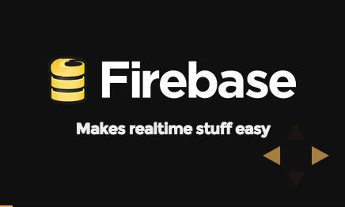

# Firebase Overview

Firebase makes building realtime stuff easy. Jenny is going to show you how in about 30 minutes with slides, demos, and 
little bit of live coding. Cut the live coding, and it takes about 10 minutes

Slides live on [mimming.com](https://mimming.com/presos/firebase-overview/)

## Presented at
- [neoHack14](http://www.meetup.com/Women-Who-Code-SF/events/182497842/?oc=evam) on 10 Sept 2014 - [tag](https://github.com/mimming/firebase-in-10-minutes/releases/tag/neoHacks14)
- [Hack Duke](http://www.hackduke.com/tech-talks) on 14 Nov 2014 - [tag](https://github.com/mimming/firebase-overview/releases/tag/hackduke14) 
- [GXdev](http://gxdev.eventbrite.com) 11 Jan 2015 - [tag](https://github.com/mimming/firebase-in-10-minutes/releases/tag/GXdev15)
- [GDG Berkeley](http://www.meetup.com/GDGBerkeley/events/219265674/) on 21 Jan 2015 - [tag](https://github.com/mimming/firebase-overview/releases/tag/2015-01-21-gdg-berkeley-meetup)
- [Game Developer Conference](https://events.withgoogle.com/gdc-developer-day/pages/code-labs/) on 2 Mar 2015 - [tag](https://github.com/mimming/firebase-overview/releases/tag/2015-03-02-gdc)
- [GDG Atlanta](http://www.meetup.com/gdg-atlanta/events/219977510/) on 10 Mar 2015 - [tag](https://github.com/mimming/firebase-overview/releases/tag/2015-03-10-gdg-atlanta)

## About the deck

Forked from the wonderful [reveal.js](https://github.com/hakimel/reveal.js)

## License

Apache 2.0

Copyright (C) 2015 Google, Inc.
